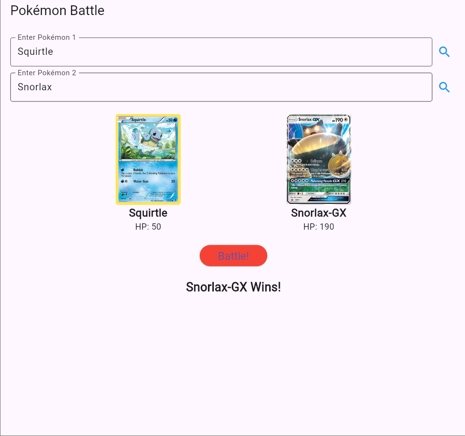

# Pokémon Battle App


## Overview
The **Pokémon Battle App** is a Flutter-based mobile application that allows users to compare two Pokémon by fetching their details from the Pokémon TCG API and determining the winner based on their HP.

## Features
- Search for Pokémon using their names.
- Fetch Pokémon details (name, image, and HP) from the Pokémon TCG API.
- Display Pokémon cards with their images and HP.
- Battle two selected Pokémon and determine the winner based on HP.
- Display battle results (win, lose, or tie).
- Error handling for invalid or missing Pokémon.

## Installation
### Prerequisites
- Flutter installed on your system
- Dart SDK
- Internet connection

### Steps
1. Clone this repository or download the source code.
2. Navigate to the project directory:
   ```sh
   cd pokemon_battle_app
   ```
3. Get the dependencies:
   ```sh
   flutter pub get
   ```
4. Run the application:
   ```sh
   flutter run
   ```

## Dependencies
The following dependencies are required for the app:
```yaml
dependencies:
  flutter:
    sdk: flutter
  http: ^0.13.3
```

## Usage
1. Enter the names of two Pokémon in the respective input fields.
2. Click the search icon to fetch details from the Pokémon TCG API.
3. The Pokémon details will be displayed with their images and HP.
4. Click the "Battle!" button to compare HP and determine the winner.
5. The winner is displayed, or a tie message is shown if both Pokémon have the same HP.

## API Used
- **Pokémon TCG API**: Fetches Pokémon card data.
  - Endpoint: `https://api.pokemontcg.io/v2/cards?q=name:<pokemon_name>`

## Error Handling
- If the Pokémon name is incorrect, an error message is displayed.
- If the API fails to load data, an error message appears.
- If both Pokémon are not selected before battling, an alert is shown.

## Screenshots
 

  

